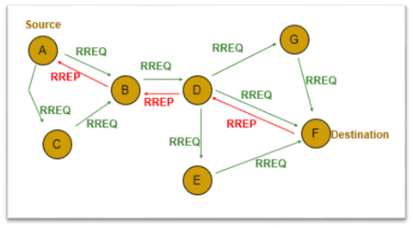

##AODV 概述##

**AODV**是按需距离矢量路由的路由协议，它是请求式相应路由协议。也就是说只有当到达某目的节点的路由不存在本地路由表中时，才会激活
该协议发起路由请求构建一条从源节点到目的节点的路径。该协议较适用于大量的节点无线自主网络。

**AODV 路由帧格式主要包括：**

- RREQ：路由请求帧
- RREP：路由应答帧
- RERR：路由错误帧
- HELLO：活跃路由链路监测帧

**AODV 路由发现与维护**

1. 当节点在本地路由表中找不到发送给目的节点的路径时，广播RREQ路由请求帧；
2. 中间节点更新各自到源节点的路由表
3. 如果收到RREQ的节点不是目的节点，并且没有到达目的节点的更新的有效路由，则转发改RREQ消息
4. 中间节点维护指向路由发起节点(源节点)的反向路由
5. 目的节点或存在到目的节点有效路由的中间节点产生RREP路由应答帧
6. 应答帧RREP通过之前建立的反向节点单播至源节点
7. 源节点收到RREP应答帧，至此源节点可以向目的节点发送数据包

改算法的具体过程如下图所示：

**注意：**

1. 在AODV协议中可能存在消息帧循环(free loop)，导致不能正确的找到目的节点。为了个解决这个问题，就给消息帧中添加序列号。
2. 在查找到目的节点的路由过程中，中间节点会更新到源节点的路由，这个称为反向路由。
3. 中间节点如果有到目的节点的路由时，只有该节点记录的目的节点序列号比RREQ中的目的节点序列号更大时，才认为这条路由是有效的。
4. **路由信息新旧判断：**
 
 - 网络中每个节点维护自身的序列号，源节点在广播路由请求帧RREQ之前要先更新自己的序列号，即将序列号加1
 - 目的节点在产生RREP应答帧之前要将自身的序列号加1
 - 该序列号是无符号数
 - 通过比较来自目的节点路由控制帧中的序列号SN1和本节点维护的目的节点的序列号SN2就可以确定本链路的新旧程度。如果SN2-SN1<0，说明路由表中维护的信息过时，应将路由信息更新至路由控制帧中最新的路由信息。
 - 网络中如果存在进常更新路由信息，这个序列号有没有可能越界？这样就会造成该协议不能长期的运行!!!! 这个也就是所谓的计数无穷问题。

5. **拥塞控制：** 当源节点接收不到目的节点的响应时，会进行再次尝试发送，当发送的次数达到一定次数之后，就认为目的节点不可达。

对于AODV协议的代码描述，请查看`/code/AODVTest`目录下面的文件
